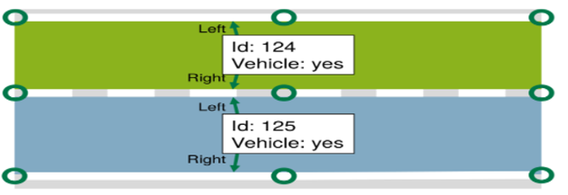
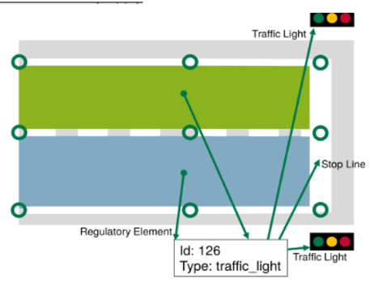

# LaneLet2_ID_Mapping
Changing Tag ID's of a poorly made LL2 file to be able to use it on Autoware simulator

## Table of Contents
    - Problem
    - soulution
    - LaneLet2 Definition and structure

## Problem Definition
We had a lanelet2 file of a city in Japan and we wanted to use that as a main map to improve planning and mapping algorithms. But, the LaneLet2 map had some unknown problems which made it impossible to run it on Autoware simulator.  
**After spending a lot of time and energy, we came to the conclusion that one of the main problems of this file is its used id's.**

for example, look at the node below:
<node id="3100422458000" lat="35.89625133963436" lon="139.94226577007007">
    <tag k="mgrs_code" v="54SVE045729"/>
    <tag k="local_x" v="4542.5099"/>
    <tag k="local_y" v="72957.9607"/>
    <tag k="ele" v="18.58"/>
  </node>

this is the first node and its id is **3100422458000**. All of the tags have the same problem so we have to write a code that changes the ID's.

## Soulution:
for this task we consider a naive way. I wrote a code that read the file and map all the ID's with numbers starting at 1. for example if we have 1000 nodes the ID's are in range from 1 to 1000. i used dictionary to map the old and new ID's

## LaneLet2 Definition and structure
Lanelet2 is an extended version of the OpenStreetMap (OSM) format, the extension is osm, and it becomes xml when exported to a file. Lanelet2 consists of the following basic objects and is divided into three types, namely node, way, and relation, according to OSM at the time of export. The following shows the description of each basic object, samples of exported files, and examples of displayed images in VMB.

Lanelet2 is a software library and data format designed for representing and working with high-definition maps for autonomous driving and other applications in the field of robotics. It provides a structured and standardized way to describe road networks, including lane geometries, traffic signs, traffic lights, and other relevant information.

### Primitives
Lanelet2 divides the world into a **hierarchical structure** of six different primitives: **Points**, **Line strings**, **polygons**, **Lanelets**, **Areas** and **regulatory elements**. [source](https://github.com/fzi-forschungszentrum-informatik/Lanelet2/blob/master/lanelet2_core/doc/LaneletAndAreaTagging.md#subtype-and-location)

All elements have in common that they are identified by a unique ID (this is useful for an efficient construction of the topological layer) and that attributes in the form of key-value pairs can be assigned to them. Some of these attributes are fixed, but additional attributes can be used to enhance the map. [Source IV, A](https://www.mrt.kit.edu/z/publ/download/2018/Poggenhans2018Lanelet2.pdf)

**Points**: A point consists of an ID, a 3d coordinate and attributes. Points are no meaningful objects. Points are only meaningful together with other objects in Lanelet2. The only situation where individual points are important is when tagging start and end points of a dashed line marking.

Points are refered as node in xml notation like below

<node id="1" lat="35.89625133963436" lon="139.94226577007007">
    <tag k="mgrs_code" v="54SVE045729" />
    <tag k="local_x" v="4542.5099" />
    <tag k="local_y" v="72957.9607" />
    <tag k="ele" v="18.58" />
</node>

**lineStrings**: Linestrings (also known as polylines or formerly linestrips) are defined by an ordered list of points with linear interpolation in between. They are the basic building block of a Lanelet map and used for any physically observable part of the map. [source](https://github.com/fzi-forschungszentrum-informatik/Lanelet2/blob/master/lanelet2_core/doc/LaneletPrimitives.md)

**Polygon:** Polygons, are rarely used to transport mapping information (except for e.g. traffic signs). Instead, they often serve as a means to add customized information about an area to the map (e.g. a region of interest).

**Lanelet:** A Lanelet consists of exactly one left and exactly one right Linestring. Together they form the drivable area of the Lanelet. [source](https://github.com/fzi-forschungszentrum-informatik/Lanelet2/blob/master/lanelet2_core/doc/LaneletPrimitives.md)

**Area**: An Area has similar properties like a Lanelet, but instead of representing directed traffic from entry to exit, an Area represents undirected traffic within its surface. An Area can have multiple entry and exit points. A typical example of an Area would be squares that are used by pedestrians or parking lots and emergency lanes for vehicles. Similar to Lanelets, traffic rules must not change on the areas. [source](https://github.com/fzi-forschungszentrum-informatik/Lanelet2/blob/master/lanelet2_core/doc/LaneletPrimitives.md)

**Regulatory Elements:** Regulatory elements are a generic way to express traffic rules. They are referenced by Lanelets or areas for which they apply.

- *traffic_sign*
- *traffic_light*
- *speed_limit*
- *right_of_way*
- *all_way_stop*

In general, regulatory elements consist of tags that generally express the type of the rule (i.e. a traffic light regulatory element) and specific information about the observable things that have a certain role for this rule (e.g. the traffic light itself and the stop line). Other types of regulatory elements are right of way and traffic sign regulatory elements [source](https://github.com/fzi-forschungszentrum-informatik/Lanelet2/blob/master/lanelet2_core/doc/LaneletPrimitives.md)

### XML notations

**node:** points

<node id="15" lat="35.90334205044301" lon="139.933505140385">
    <tag k="mgrs_code" v="54SVE037737" />
    <tag k="local_x" v="3760.4447" />
    <tag k="local_y" v="73753.0484" />
    <tag k="ele" v="19.33" />
  </node>

**way:** linestrings

<way id="4611">
    <nd ref="3401" />
    <nd ref="3602" />
    <nd ref="3603" />
    <nd ref="3604" />
    <nd ref="3605" />
    <nd ref="3606" />
    <nd ref="3607" />
    <nd ref="3608" />
    <nd ref="3609" />
    <nd ref="3610" />
    <nd ref="3611" />
    <nd ref="709" />
    <tag k="type" v="line_thin" />
    <tag k="subtype" v="solid" />
    <tag k="color" v="white" />
    <tag k="width" v="0.2 m" />
  </way>

**relation:** lanelets, Areas, regulatory_elements and exc.

 <relation id="4788">
    <member type="way" role="left" ref="4685" />
    <member type="way" role="right" ref="4686" />
    <member type="way" role="centerline" ref="4687" />
    <tag k="type" v="lanelet" />
    <tag k="subtype" v="road" />
    <tag k="speed_limit" v="10" />
    <tag k="location" v="urban" />
    <tag k="one_way" v="yes" />
    <tag k="region" v="jp" />
    <tag k="dmp_rfdb_road_segment_id" v="142980" />
    <tag k="dmp_lane_number" v="1" />
    <tag k="dmp_rfdb_work_unit_id" v="10808" />
    <tag k="udbx3_lane_type" v="normal_driving_lane" />
  </relation>

  <relation id="4789">
    <member type="way" role="refers" ref="4310" />
    <member type="way" role="ref_line" ref="4301" />
    <tag k="type" v="regulatory_element" />
    <tag k="subtype" v="traffic_light" />
  </relation>